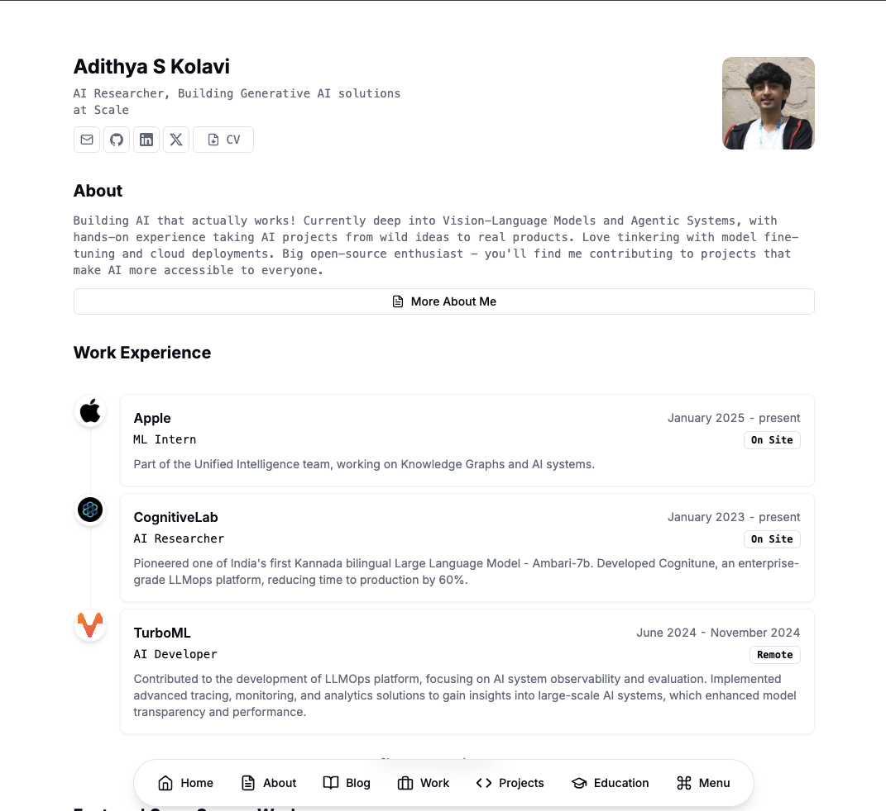

# My Portfolio

Welcome to my personal portfolio website, where you can explore my work, read my blogs, and even play an interactive resume game!

    

- **Portfolio**: [adithyask.com](https://adithyask.com)

## Introduction

Welcome to my personal portfolio! This website serves as a central hub where you can explore my projects, read my tech blogs, and even have some fun with an interactive resume game. Feel free to navigate through the various sections and learn more about my skills, experiences, and the things I'm passionate about.

## Features

- **Portfolio**: Explore my diverse range of projects, from web development to machine learning.
- **Blogs**: Read my tech blogs covering various topics in the world of technology and programming.
- **Interactive Resume Game**: Play a unique resume game where you can experience my skills and achievements in an engaging way.

## Usage

- **Portfolio**: Visit [adithyask.com](https://adithyask.com) and navigate through the different sections to explore my projects and skills.
- **Interactive Resume Game**: For a unique experience, try out the [interactive resume game](https://game.adithyask.com) to learn more about me in a fun and interactive way.

## License

This project is under a private license, and it is not open for contributions. All rights are reserved. Thank you for visiting my portfolio! If you have any questions or want to get in touch, you can reach out to me through the contact information provided on the website. Enjoy your journey through my projects and blogs!
